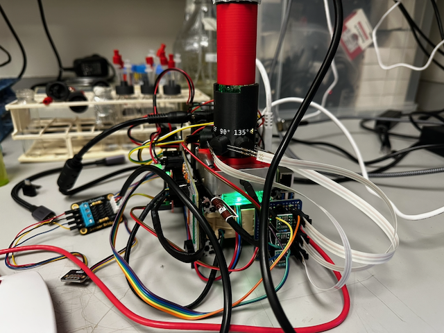
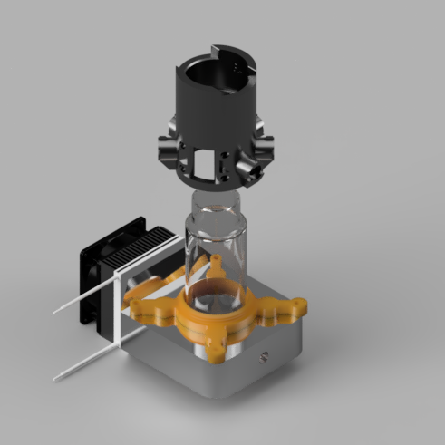
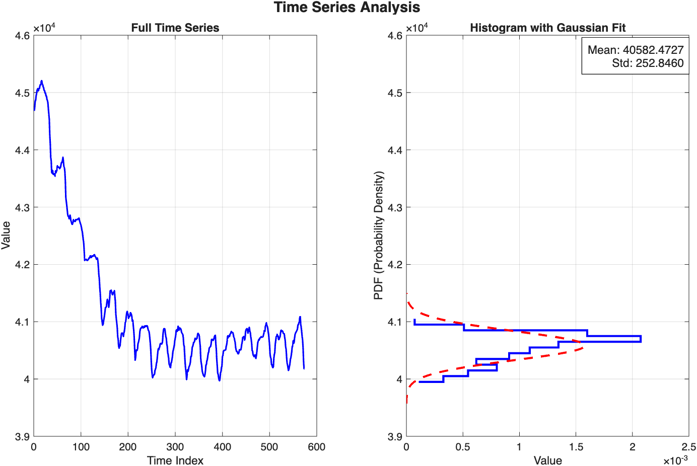

# Overview
The bioreactor has been redesigned as single modular units instead of the four bioreactor units that I was designing before. This is to facilitate individual temperature and gas control and in anticipation of building networked ecosystems of bioreactors. In addition the software was rewritten and now includes sensors that can measure gas composition (CO2 and O2 currently).  A gas control system has been built that can run the bioreactors in controlled, elevated carbon dioxide $(<10\%)$ environments by mixing CO2 and air in different proportions.  Finally, a pumping system than can support up to 8 pumps has been integrated, and a two pump system (feed/waste) has been programmed with a turbidostat mode that tracks growth rate in real time using an estimator based on the extended Kalman filter [-@Hoffmann2017-po].



# Mounting
Bioreactors are now mounted between two sets of construction rails. One set of 60 mm long 15 mm diameter [Makerbeam](https://www.makerbeam.com/) construction rails sits between the bioreactor temperature control block and the fan that controls the stirring. In the space between the temperature control block and the fan, a LED ring light in a custom designed acrylic case provides a stable base for the vial and illuminates the vial from below.

# Improved Temperature Control System
An improved temperature control system was designed and constructed. The temperature control system consists of the same DS18B20 thermometer, but the liquid cooling system has been replaced with a solid-state Peltier element cooling system driven by a [Cytron motor driver](https://thepihut.com/products/13amp-6v-30v-dc-motor-driver) and a custom machined aluminium block that sits around the lower 20mm of the vial. The block is designed to enclose as much of the vial as possible leaving room above for the optics above.  The aluminum block was designed to be twenty millimeters deep but to accommodate a 40mm Peltier element. [This block](./files/HeatingBlock_New%20v5.stl) was designed in Autodesk Fusion and machined by [eMachineShop](https://www.emachineshop.com/). Temperature measurements for the PID controller take place in a hole at the front of the aluminium block and with the [DS18B20](https://thepihut.com/products/ds18b20-digital-temperature-sensor-extras) temperature probe placed in contact with the glass vial. The [Pioreactor base](https://www.printables.com/model/863347-pioreactor-20ml-v11-printable-parts/files) was modified to create a custom base plate that attached to the aluminium block via M3x4mm screws.  The CAD file for this can be found [here](./files/pio_adapter.stl).  This facilitates connecting the Pioreactor optics sleeve to the aluminium block. 



To characterise how quickly the Peltier block can move the vial between temperature setpoints, I used the `temperature_profile` schedule from the [`yeast_ekf.py`](https://github.com/livingphysics/bioreactor_v3/blob/main/examples/yeast_ekf.py) EKF job that produced this dataset: 25 °C for the first 3 hours, then 27.5 °C for 3 hours, then 30 °C. That gives two commanded shifts — at 180 min and 360 min — and the figure below overlays the two transients aligned to the moment each setpoint was changed. Settling time is defined as the first time $|T - T_{\text{set}}|$ enters and stays below a 0.1 °C band for at least 60 s.

```{python}
#| label: fig-temp-settling
#| fig-cap: "Temperature step-response of the Peltier control block extracted from the 9-hour run. Measured vial temperature is aligned to the moment each setpoint was changed; dotted/dashed horizontal lines mark the before/after setpoints, and the vertical marker shows the settling time (first time |T − T$_{set}$| enters and stays below a 0.1 °C band for 60 s)."

import numpy as np
import pandas as pd
import matplotlib.pyplot as plt

CSV_URL = ("https://raw.githubusercontent.com/livingphysics/bioreactor_v3/"
           "main/src/bioreactor_data/bioreactor_data.csv")
df = pd.read_csv(CSV_URL)

t_min = df['elapsed_time'].values.astype(float) / 60.0
T = df['temperature_C'].values.astype(float)

# Setpoint schedule from examples/yeast_ekf.py (temperature_profile):
#   stage 1: 0 → 180 min  @ 25.0 °C
#   stage 2: 180 → 360 min @ 27.5 °C
#   stage 3: 360 min → end @ 30.0 °C
profile = [(0.0, 25.0), (180.0, 27.5), (360.0, 30.0)]
transitions = [(profile[k][0], profile[k - 1][1], profile[k][1])
               for k in range(1, len(profile))]

WINDOW_BEFORE = 5.0
WINDOW_AFTER  = 45.0
TOL = 0.1
HOLD = 1.0

fig, ax_t = plt.subplots(1, 1, figsize=(7.5, 4.5))
colors = ['#1976D2', '#D32F2F', '#388E3C', '#7B1FA2']

for k, (t0, T_before, T_after) in enumerate(transitions):
    mask = (t_min >= t0 - WINDOW_BEFORE) & (t_min <= t0 + WINDOW_AFTER)
    tt = t_min[mask] - t0
    TT = T[mask]
    c = colors[k % len(colors)]

    err = np.abs(TT - T_after)
    after = tt >= 0
    tt_a = tt[after]; err_a = err[after]
    settle_t = np.nan
    within = err_a <= TOL
    for j in range(len(tt_a)):
        if not within[j]:
            continue
        j_end = np.searchsorted(tt_a, tt_a[j] + HOLD)
        if j_end <= len(tt_a) and np.all(within[j:j_end]):
            settle_t = tt_a[j]
            break

    settle_txt = f'{settle_t:.1f} min' if np.isfinite(settle_t) else '—'
    label = f'{T_before:.1f} → {T_after:.1f} °C  (settle: {settle_txt})'
    ax_t.plot(tt, TT, '-', color=c, linewidth=1.2, label=label)
    ax_t.axhline(T_before, color=c, linestyle=':',  linewidth=0.7, alpha=0.5)
    ax_t.axhline(T_after,  color=c, linestyle='--', linewidth=0.7, alpha=0.7)
    if np.isfinite(settle_t):
        ax_t.axvline(settle_t, color=c, linestyle='-', linewidth=0.8, alpha=0.5)
        ax_t.plot(settle_t, T_after, 'o', color=c, markersize=6,
                  markeredgecolor='black', markeredgewidth=0.6)

ax_t.axvline(0, color='grey', linewidth=0.8, alpha=0.6)
ax_t.set_xlabel('Time since setpoint shift (min)')
ax_t.set_ylabel('Temperature (°C)')
ax_t.legend(loc='lower right', fontsize=9)
ax_t.grid(True, alpha=0.3)

plt.tight_layout()
plt.show()
```

# PWM Control of LED output
The maximum continuous forward current for the LED should not exceed 100mA. A $1k\Omega$ pull-down resistor from the CTRL pin to ground was added to prevent voltage spikes that were burning out the Femtobuck. This combination gives much more flexibility for the infrared LED control, as output is no longer fixed at 75,A but can be adjusted.  The pull-down resistors prevents the over-voltage spikes that were burning out previous boards. Based on the Femtobuck voltage to current graph, this corresponds to around 1.0V.  For the PWM signal 1 = DUTY*3.3, so the maximum duty cycle of for the PWM pin controlling the LED should be 30%. For our custom OP380 Amplifier circuit, we found the optimal IR intensity to be 15%, while for the Pioreactor [Eye-Spy](https://pioreactor.com/products/eye-spy-replacement-part) system, this was 8%. Optimal in this case was defined by sweeping the LED intensity from zero to twenty percent for both a blank and a dense culture and looking at the intensity for which the difference was maximal. A GUI for doing a similar test can be found [here](https://github.com/livingphysics/bioreactor_v3/blob/main/hardware_testing/od_gui.py).

# Gas composition sensors
Gas composition can now also be monitored and recorded. The two gases included in this update are carbon dioxide (CO2) and oxygen (O2). The gas sensor used for oxygen is and [Atlas scientific](https://atlas-scientific.com/) gas sensor, and for CO2 is either an Atlas sensor (up to 10,000ppm/1%) or a [Sensair](https://www.digikey.co.uk/en/products/detail/senseair/033-9-0023/13536026) K33 (up to 100,000ppm/10%).  Both sensors have an I2C mode, which is used via the [atlas_i2c](https://github.com/timboring/atlas_i2c) library and custom python library I wrote for the Sensair based on their communication specification.  This [library](https://github.com/livingphysics/bioreactor_v3/blob/main/hardware_testing/sensair_k33.py) can be found in the bioreactor_v3 repository in the hardware support directory. A custom 3D printed adapter was designed to couple the 24-400 threaded vial to the NPT 3/4 threaded Atlas sensors.  The CAD file for the single sensor design can be found [here](./files/AtlasCapSingle.stl) and for the double sensor hammerhead design can be found [here](./files/Atlas-T-Cap.stl).

::: {#fig-atlas-caps layout-ncol=2}


Custom 3D-printed caps adapting 24-400 vial threads to NPT 3/4 Atlas gas sensors.
:::

# Gas control system
The gas control system combines pure CO2 from an aquarium or Sodastream CO2 source with pressurized air from a 12V pump.  These are the incoming gas from the CO2 canister is controlled by a 12V normally closed (NC) solenoid valve.  The gases are mixed in a Vuyomua 300ml stainless steel reservoir and kept at approximately 2atm by periodic pressurization from the pump and CO2 injection from the canister to maintain the appropriate CO2 concentration.  These are measured in the outflow of the reservoir before it enters the bioreactor and fed back to the CO2 injection duration.  

::: {#fig-co2-control}



A CO2 setpoint can be maintained with a standard deviation of about 225ppm 
:::

# Pump System
Each individual bioreactor now controls its own 2-pump system.  The pump system consists of 2 [stepper motor controlled peristaltic pumps](https://www.amazon.co.uk/dp/B07RWNZDCR), a fresh media feed pump and a waste removal pump.  The pumps are powered by a dedicated [6A power supply](https://www.amazon.co.uk/dp/B0CGR54L81) and connected through a [USB-C hub](https://thepihut.com/products/ethernet-hub-and-usb-hub-w-micro-usb-otg-connector?variant=27740258513) for the Pi5 or a [USB-micro Hub](https://thepihut.com/products/usb-mini-hub-with-power-switch-otg-micro-usb?variant=27740257873) for a PiZero to [Pololu Tic](https://www.pololu.com/product/3130) stepper motor controllers. The pumps are connected by luer lock adapters to stainless steel syringe needles in custom [3D printed caps](https://labcrafter.co.uk/products/40ml-glass-vial-cap-s-with-ports-and-stir-bar).  Pumps are connected to media feed bottle using these [custom printed lids](https://pioreactor.com/collections/accessories-and-parts/products/gl45-cap-with-luer-lock-connectors?variant=46788561403960) with the 14 inch tubing option.  

# Kalman Filter Based Turbidostat Mode
The turbidostat is driven by an extended Kalman filter (EKF) that tracks two hidden states — the optical density $\mathrm{OD}_k$ of the culture and a per-cycle multiplicative growth rate $r_k$ — from the noisy photodiode voltage measured each cycle. The state transition is multiplicative, $\mathrm{OD}_{k+1} = r_k\,\mathrm{OD}_k$ with $r_{k+1}=r_k$, which the filter linearises through the Jacobian
$$F = \begin{pmatrix} r & \mathrm{OD} \\ 0 & 1 \end{pmatrix}.$$
The measurement model observes OD directly ($H=[1,\,0]$), so the growth rate is inferred only through the predicted and measured OD. From the updated rate estimate the doubling time is reported as $T_d = \Delta t \,\ln 2 / \ln r$, with its uncertainty propagated from the corresponding entry of the covariance matrix. The full implementation lives in [`turbidostat_ekf_mode`](https://github.com/livingphysics/bioreactor_v3/blob/main/src/utils.py) in `src/utils.py`; when no active turbidostat job is running the same predict/update step is run passively each time the sensors are logged, so that growth rate is always available in the CSV output.

The filter follows the design in [-@Hoffmann2017-po], including their treatment of dilution events. Each pump firing causes a step drop in OD that the multiplicative process model cannot account for, and if left untreated this drives spurious corrections into the growth-rate estimate. Instead, the moment a pump fires the OD prediction is reset to the raw measurement, the OD variance is inflated to a "distrust" value (10× the measurement noise by default), and the off-diagonal covariance terms are zeroed so that the dilution transient cannot leak into $r$. The filter then re-converges over the next ten cycles. A second guard rejects single-sample sensor glitches: if an innovation exceeds five standard deviations the off-diagonal terms are again zeroed and the OD variance is reset to the squared residual, which prevents a stray reading from poisoning the growth-rate estimate.

The turbidostat job itself is scheduled like any other periodic task on the bioreactor (typically every 10 s). Each cycle reads the most recent OD from the live CSV, runs the EKF update, and — if the filtered OD estimate has crossed the user-supplied setpoint — fires the inflow pump for a fixed duration and the outflow pump for 1.1× that duration via [`independent_flow`](https://github.com/livingphysics/bioreactor_v3/blob/main/src/utils.py). The filter is initialised from the first valid OD reading with $r_0 = 1$ (no growth), and the measurement noise $R$, growth-rate process noise $Q_r$, pump-distrust covariance and distrust-cycle count are all exposed as job arguments. To make tuning these tractable, the [`ekf_tuning_gui.py`](https://github.com/livingphysics/bioreactor_v3/blob/main/hardware_testing/ekf_tuning_gui.py) tool replays a historical run through the same filter code with log-scale sliders for each parameter, so the effect of a change on the OD estimate, growth rate and doubling time can be seen immediately against real data.

The figure below replays a ~9 hour turbidostat run for a yeast culture in which the temperature setpoint was stepped through three values, applying the same EKF used online. The raw photodiode trace shows the characteristic sawtooth of dilution events, the filtered OD tracks through them via the pump-distrust mechanism, and the inferred doubling time settles to a different steady value at each temperature plateau. This is able to resolve at leas 20 minute $\approx 10\%$ differences in generation time for the yeast culture.

```{python}
#| label: fig-ekf-replay
#| fig-cap: "EKF replay of a 9-hour turbidostat run stepping through three temperatures. Top: raw OD voltage (grey) with EKF estimate (blue, ±1σ band) and pump events (orange ticks). Middle: inferred doubling time. Bottom: temperature setpoint trace."

import numpy as np
import pandas as pd
import matplotlib.pyplot as plt

CSV_URL = ("https://raw.githubusercontent.com/livingphysics/bioreactor_v3/"
           "main/src/bioreactor_data/bioreactor_data.csv")
df = pd.read_csv(CSV_URL)

times = df['elapsed_time'].values.astype(float)
measurements = df['Eyespy_sct_V'].values.astype(float)
pump_cum = df['pump_inflow_time_s'].values.astype(float)
pump_events = np.zeros(len(times), dtype=bool)
pump_events[1:] = np.diff(pump_cum) > 0


def run_ekf_replay(times, measurements, pump_events,
                   R=0.001, Q_growth_rate=5e-12,
                   initial_growth_rate=1.0, initial_P_r=0.0005**2,
                   pump_distrust_cycles=10, pump_distrust_P_od=None):
    n = len(times)
    if pump_distrust_P_od is None:
        pump_distrust_P_od = 10.0 * R
    od_est = np.full(n, np.nan); growth_rate = np.full(n, np.nan)
    doubling_time_s = np.full(n, np.nan); od_std = np.full(n, np.nan)
    r_std = np.full(n, np.nan); dt_std = np.full(n, np.nan)

    x = np.array([measurements[0], initial_growth_rate])
    P = np.array([[R, 0.0], [0.0, initial_P_r]])
    distrust_counter = 0
    last_time = times[0]
    dt_median = np.median(np.diff(times))
    od_est[0] = x[0]; growth_rate[0] = x[1]
    od_std[0] = np.sqrt(R); r_std[0] = np.sqrt(initial_P_r)
    I2 = np.eye(2); H_vec = np.array([1.0, 0.0])

    for i in range(1, n):
        z_k = measurements[i]
        if np.isnan(z_k):
            od_est[i] = od_est[i-1]; growth_rate[i] = growth_rate[i-1]
            doubling_time_s[i] = doubling_time_s[i-1]
            od_std[i] = od_std[i-1]; r_std[i] = r_std[i-1]; dt_std[i] = dt_std[i-1]
            continue
        last_time = times[i]
        if pump_events[i]:
            distrust_counter = pump_distrust_cycles

        od_k, r_k = x
        x_pred = np.array([od_k * r_k, r_k])
        F = np.array([[r_k, od_k], [0.0, 1.0]])
        Q_mat = np.array([[0.0, 0.0], [0.0, Q_growth_rate]])
        P_pred = F @ P @ F.T + Q_mat

        if pump_events[i] or distrust_counter > 0:
            P_pred[0, 0] = pump_distrust_P_od
            P_pred[0, 1] = 0.0; P_pred[1, 0] = 0.0
            x_pred[0] = z_k
            if not pump_events[i]:
                distrust_counter -= 1

        y = z_k - x_pred[0]
        S = P_pred[0, 0] + R
        K = P_pred[:, 0] / S
        x_updated = x_pred + K * y
        P_updated = (I2 - np.outer(K, H_vec)) @ P_pred

        if abs(z_k - x_pred[0]) > 5.0 * np.sqrt(R):
            P_updated[0, 1] = 0.0; P_updated[1, 0] = 0.0
            P_updated[0, 0] = (x_updated[0] - z_k) ** 2

        x, P = x_updated, P_updated
        od_est[i] = x[0]; growth_rate[i] = x[1]
        od_std[i] = np.sqrt(P[0, 0]); r_std[i] = np.sqrt(P[1, 1])

        r_est = x[1]
        if r_est > 1.0:
            ln_r = np.log(r_est)
            dt_val = dt_median * np.log(2.0) / ln_r
            if dt_val <= 86400.0:
                doubling_time_s[i] = dt_val
                dt_std[i] = dt_median * np.log(2.0) * r_std[i] / (r_est * ln_r ** 2)

    return dict(od_est=od_est, growth_rate=growth_rate,
                doubling_time_s=doubling_time_s,
                od_std=od_std, r_std=r_std, dt_std=dt_std)


result = run_ekf_replay(times, measurements, pump_events, Q_growth_rate=5e-12)

t_h = times / 3600.0
mask = t_h <= 9.0
t_h = t_h[mask]
raw_od = measurements[mask]
ekf_od = result['od_est'][mask]
od_sd = result['od_std'][mask]
dt_min = result['doubling_time_s'][mask] / 60.0
dt_sd_min = result['dt_std'][mask] / 60.0
temp = df['temperature_C'].values.astype(float)[mask]
pump_times = t_h[pump_events[mask]]

fig, (ax_od, ax_dt, ax_temp) = plt.subplots(3, 1, figsize=(11, 7.5), sharex=True)
fig.subplots_adjust(hspace=0.12)

ax_od.plot(t_h, raw_od, '.', color='#cccccc', markersize=2, label='Raw OD', zorder=1)
ax_od.plot(t_h, ekf_od, '-', color='#2196F3', linewidth=1.2, label='EKF OD est', zorder=3)
ax_od.fill_between(t_h, ekf_od - od_sd, ekf_od + od_sd, color='#2196F3', alpha=0.15, zorder=2)
for pt in pump_times:
    ax_od.axvline(pt, color='#FF5722', alpha=0.3, linewidth=0.8)
ax_od.set_ylabel('OD (V)')
ax_od.legend(loc='upper left', fontsize=9)
ax_od.grid(True, alpha=0.3)

dt_upper = np.where(np.isfinite(dt_min) & np.isfinite(dt_sd_min), dt_min + dt_sd_min, np.nan)
dt_lower = np.where(np.isfinite(dt_min) & np.isfinite(dt_sd_min),
                    np.maximum(dt_min - dt_sd_min, 0), np.nan)
ax_dt.plot(t_h, dt_min, '-', color='#9C27B0', linewidth=1.2, label='Doubling time')
ax_dt.fill_between(t_h, dt_lower, dt_upper, color='#9C27B0', alpha=0.15)
for pt in pump_times:
    ax_dt.axvline(pt, color='#FF5722', alpha=0.3, linewidth=0.8)
finite_vals = dt_min[np.isfinite(dt_min)]
if len(finite_vals):
    p5, p95 = np.percentile(finite_vals, [5, 95])
    margin = (p95 - p5) * 0.15
    ax_dt.set_ylim(max(0, p5 - margin), p95 + margin)
ax_dt.set_ylabel('Doubling time (min)')
ax_dt.legend(loc='upper left', fontsize=9)
ax_dt.grid(True, alpha=0.3)

ax_temp.plot(t_h, temp, '-', color='#E65100', linewidth=1.2, label='Temperature')
ax_temp.set_ylabel('Temperature (°C)')
ax_temp.set_xlabel('Elapsed time (hours)')
ax_temp.legend(loc='upper left', fontsize=9)
ax_temp.grid(True, alpha=0.3)
plt.show()
```

# Minor improvements
Similar to the  $1k\Omega$ pull-down resistor for the Femtobuck control pin, a $1k\Omega$ pull-down resistor was also added to the fan control PWM pin. 

# Detailed Assembly Instructions
1. Tap 4 corner holes on both sides fo the [aluminium vial heat block]() using an M3 tap.
2. Connect the Peltier element red-wire to V+ and the black-wire to Gnd.  Feel which side gets cold, this is usually the printed side.  Attach this side to te aluminium block using thermally conductive double-sided tape (or another conductive adhesive) 
3.  Connect the other side of the Peltier in the same manner to the aluminum heat-sink fan combination.
4. Connect 8 M3x8mm screws with hex-nuts through the holes in the Noctua fan.  The hex-nuts should be on the top and bottom sides of the fan.  Connect the Open-beam 15x15 construction rail to the fan with the fan cable coming out the front fo the construct, the 60mm rail on top and (open side) and the 90mm rail on the bottom.
5. Affix the magnets to the fan with 3M adhesive tape. 
6. Half screw 4 M3x6mm screws into the bottom the of the aluminium vial heat block and slide it onto the top (60mm) construction rail. 
7. Affix the Cytron motor driver to the heat-sink fan using 3M double sided adhesive with the screw terminals to the right side. Attach the red peltier wire to the ma terminal and the black to the mb terminal.
8. Attach the Pioreactor sleeve to the custom adaptor and then attach the adaptor to the aluminium block with 4 m3x4mm screws ensuring the LED and PD holes are to the left side.
9.  Remove the male connector cable from the ring light with snips. Thread the female end connector through the hole in the custom acrylic holder.  Affix the spacers on either side of the ring light and then affix the final piece on the top. Slide this into the slot between the upper construction rails. Solder the male connector leads to Red:5V, Black:Ground, and Blue:MOSI pin on the Pi.
10.  Solder the 40 pin connector to the perma-proto board with the notch on the left side
11. Solder 6 pin connectors and headers for the ADS1115 ADC, and a 4-pin header with the top 2 pins overlapping pins 20 and 21 of the Raspberry Pi, and connect, the fourth pin to ground. 
12. Connect the control pin to pin 25 of the Raspberry Pi and also to ground via a 1kOhm resistor. Connect VIN:12V and PGND:Ground.
13. Solder SDA and SCL pins from the Pi and the ADS1115 together, and solder Vin:5v and Gnd:Ground.
14. Solder 2 4-pin male headers for the fan control and thermistor.  Connect Pin 1 (blue) to ground and to pin 12 on the Pi.
15. Solder the V+ terminal of the DS18B20 (3) to the yellow wire of the spare extension cable from the fan with the female header cut off. Solder th ground pin (1) to the black wire, and the signal pin (2) to the blue wire. 